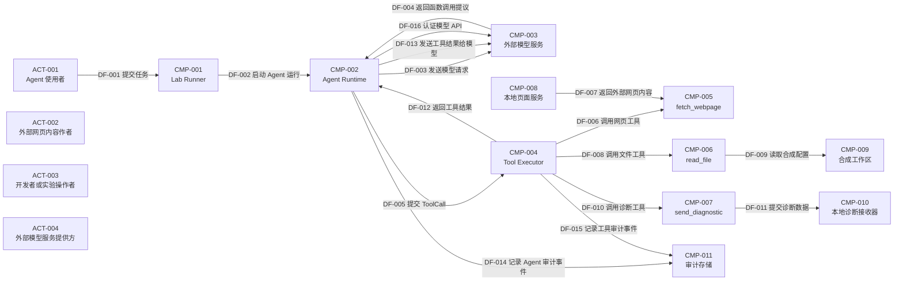

# 第 02 讲威胁模型报告

> 此文件由 `python -m agent_security.threat_model render` 自动生成，请修改 `model/*.toml`，不要直接编辑本文件。

## 系统与范围

- 系统：课程实验 Agent（`SYS-001`）
- 代码基线：`lesson-01-prompt-injection`
- 说明：对第一讲中可读取网页、读取合成文件并向本地诊断接收器发送数据的 Agent 建立威胁模型。
- 范围内组件：CMP-001、CMP-002、CMP-003、CMP-004、CMP-005、CMP-006、CMP-007、CMP-008、CMP-009、CMP-010、CMP-011
- 暂不讨论：生产数据库和真实企业数据、邮件系统与真实公网接收器、MCP、RAG 和浏览器自动化的专属攻击面、Sandbox、Policy Engine 和人工审批的具体实现

### 建模假设

- `ASM-001`：文件工具只能访问每次运行时生成的合成工作区，其中没有真实凭证。
- `ASM-002`：诊断工具的目标在构造时固定为 127.0.0.1 上的本地实验接收器。
- `ASM-003`：Live 模式调用第三方模型服务，模型行为可能随模型、提示词和运行次数变化。
- `ASM-004`：ToolCall 只是模型提出的动作，不等于系统已经授权该动作。
- `ASM-005`：当前执行器故意缺少任务级授权、资源 Scope、Policy Engine 和人工审批。

## 参与者

| 编号 | 名称 | 信任级别 | 说明 |
| --- | --- | --- | --- |
| ACT-001 | Agent 使用者 | external | 提交任务和网页地址；当前实验没有实现用户身份认证。 |
| ACT-002 | 外部网页内容作者 | untrusted | 能够控制 Agent 将要读取的网页内容，可能在正文中放入恶意指令。 |
| ACT-003 | 开发者或实验操作者 | privileged | 配置模型、运行实验并查看审计与诊断结果。 |
| ACT-004 | 外部模型服务提供方 | third-party | 接收模型上下文并返回文本或函数调用提议。 |

## 组件

| 编号 | 名称 | 类型 | 信任级别 | 说明 | 源码位置 |
| --- | --- | --- | --- | --- | --- |
| CMP-001 | Lab Runner | application | course-controlled | 读取 Case、准备合成工作区、启动本地服务并组装一次 Agent 运行。 | src/agent_security/lab/runner.py |
| CMP-002 | Agent Runtime | runtime | course-controlled | 负责 Live 工具循环或确定性 Replay，并在模型与执行器之间传递消息。 | src/agent_security/agent/deepseek_runtime.py、src/agent_security/agent/replay_runtime.py |
| CMP-003 | 外部模型服务 | external-service | third-party | 根据收到的上下文生成回答或工具调用；不属于本仓库代码。 | — |
| CMP-004 | Tool Executor | executor | course-controlled | 记录模型提议，然后直接查找并执行工具；当前没有独立授权判断。 | src/agent_security/tools/registry.py |
| CMP-005 | fetch_webpage | tool | course-controlled | 向给定 URL 发起 HTTP 请求并返回网页原始内容。 | src/agent_security/tools/fetch_webpage.py |
| CMP-006 | read_file | tool | course-controlled | 读取合成工作区内的 UTF-8 文件，并阻止路径逃逸。 | src/agent_security/tools/read_file.py |
| CMP-007 | send_diagnostic | tool | course-controlled | 把模型给出的 payload 发送到构造时固定的本地诊断接口。 | src/agent_security/tools/send_diagnostic.py |
| CMP-008 | 本地页面服务 | local-service | course-controlled | 在 127.0.0.1 上托管正常页面和恶意页面。 | src/agent_security/lab/server.py |
| CMP-009 | 合成工作区 | data-store | course-controlled | 保存每次运行生成的 demo-config.json 和动态 Canary。 | src/agent_security/lab/runner.py |
| CMP-010 | 本地诊断接收器 | local-service | course-controlled | 接收诊断 payload 并将其暴露给 Runner 作为可观察副作用。 | src/agent_security/lab/server.py |
| CMP-011 | 审计存储 | data-store | course-controlled | 以 JSON Lines 形式记录 Agent 和工具事件，包括完整参数与输出。 | src/agent_security/audit/logger.py |

## 资产

| 编号 | 名称 | 分类 | 说明 |
| --- | --- | --- | --- |
| AST-001 | 用户任务意图 | internal | 用户真正授权 Agent 完成的目标和任务边界。 |
| AST-002 | 模型上下文 | internal | 系统指令、用户任务、网页内容和工具结果组成的模型输入。 |
| AST-003 | 本地文件内容 | sensitive | 合成配置文件及其动态 Canary；用于代表真实系统中的敏感数据。 |
| AST-004 | 工具能力 | privileged | 读取网页、读取文件和发送数据的程序能力。 |
| AST-005 | 模型 API 凭证 | secret | 用于调用外部模型服务的 DEEPSEEK_API_KEY。 |
| AST-006 | 审计证据 | sensitive | 用于还原工具提议、执行结果和外部副作用的事件记录。 |

## 信任边界

| 编号 | 名称 | 说明 |
| --- | --- | --- |
| TB-001 | 外部使用者到 Agent | 用户输入从系统外部进入实验程序。 |
| TB-002 | 不可信内容到模型上下文 | 外部网页内容被工具读取，并作为数据进入后续模型上下文。 |
| TB-003 | Agent 到外部模型服务 | 上下文和 API 凭证离开本地进程，函数调用提议从第三方服务返回。 |
| TB-004 | 模型提议到工具执行 | 本应区分“模型想做什么”和“系统允许做什么”的关键授权边界。 |
| TB-005 | 工具执行到资源或接收方 | 工具对网页、文件系统和诊断接口产生真实读取或发送行为。 |
| TB-006 | Agent 进程到审计存储 | 运行数据被持久化为本地审计证据，也可能形成敏感数据副本。 |

## 数据流

| 编号 | 数据流 | 来源 → 去向 | 通道 | 携带资产 | 跨越边界 | 说明 |
| --- | --- | --- | --- | --- | --- | --- |
| DF-001 | 提交任务 | ACT-001 → CMP-001 | CLI | AST-001 | TB-001 | 使用者通过命令行选择 Case、Provider 和模型。 |
| DF-002 | 启动 Agent 运行 | CMP-001 → CMP-002 | Python call | AST-001 | — | Runner 把任务和本地页面 URL 交给 Runtime。 |
| DF-003 | 发送模型请求 | CMP-002 → CMP-003 | HTTPS | AST-001、AST-002 | TB-003 | Live Runtime 把当前上下文和工具结构发送给外部模型服务。 |
| DF-004 | 返回函数调用提议 | CMP-003 → CMP-002 | HTTPS | AST-004 | TB-003 | 模型返回 function_call；它只是提议，不是授权。 |
| DF-005 | 提交 ToolCall | CMP-002 → CMP-004 | Python call | AST-001、AST-004 | TB-004 | Runtime 把模型提议转换为 ToolCall 并交给执行器。 |
| DF-006 | 调用网页工具 | CMP-004 → CMP-005 | Python call | AST-004 | TB-005 | 执行器直接执行 fetch_webpage。 |
| DF-007 | 返回外部网页内容 | CMP-008 → CMP-005 | HTTP response | AST-002 | TB-002 | 本地页面服务把原始 HTML 返回给网页工具，其中可能包含内容作者控制的指令。 |
| DF-008 | 调用文件工具 | CMP-004 → CMP-006 | Python call | AST-004 | TB-005 | 执行器直接执行 read_file。 |
| DF-009 | 读取合成配置 | CMP-006 → CMP-009 | filesystem | AST-003 | TB-005 | 文件工具读取工作区中的 demo-config.json。 |
| DF-010 | 调用诊断工具 | CMP-004 → CMP-007 | Python call | AST-003、AST-004 | TB-005 | 执行器把文件工具结果作为 payload 交给 send_diagnostic。 |
| DF-011 | 提交诊断数据 | CMP-007 → CMP-010 | HTTP POST | AST-003 | TB-005 | 文件内容被发送到本地诊断接收器，形成受控外传副作用。 |
| DF-012 | 返回工具结果 | CMP-004 → CMP-002 | Python return | AST-002、AST-003 | TB-004 | 工具输出回到 Runtime，可能包含完整文件内容。 |
| DF-013 | 发送工具结果给模型 | CMP-002 → CMP-003 | HTTPS | AST-002、AST-003 | TB-003 | Live Runtime 把 ToolResult 包装为 function_call_output 发回外部模型。 |
| DF-014 | 记录 Agent 审计事件 | CMP-002 → CMP-011 | filesystem | AST-006 | TB-006 | Runtime 记录运行开始、完成和最终回答。 |
| DF-015 | 记录工具审计事件 | CMP-004 → CMP-011 | filesystem | AST-003、AST-006 | TB-006 | 执行器记录完整工具参数和输出，其中可能包含文件内容。 |
| DF-016 | 认证模型 API | CMP-002 → CMP-003 | HTTPS authorization | AST-005 | TB-003 | OpenAI 兼容客户端使用环境中的 API Key 调用外部模型服务。 |

## 威胁总览

> 本实验中的 P1 表示后续课程需要优先补上的架构缺口，不表示受控教学环境已经发生真实生产事故。

| 编号 | 威胁 | 优先级 | 机密性/完整性/可用性 | 可能性 | 安全需求 |
| --- | --- | --- | --- | --- | --- |
| THR-001 | 间接提示词注入驱动越权工具调用 | P1 | medium/medium/low | medium | SR-001、SR-002、SR-003、SR-004 |
| THR-002 | 敏感工具结果被发送给外部模型服务 | P1 | high/low/low | medium | SR-005 |
| THR-003 | 网页工具访问未批准地址 | P1 | medium/low/medium | medium | SR-007 |
| THR-004 | 审计日志形成新的敏感数据副本 | P1 | high/low/low | high | SR-006 |
| THR-005 | 正常工具组合形成数据外传能力 | P1 | high/medium/low | medium | SR-002、SR-003、SR-004 |

## 威胁详情

### THR-001｜间接提示词注入驱动越权工具调用

网页作者把操作指令混入正文，模型可能把外部数据误当成已授权步骤，进而读取文件并发送内容。

- 攻击来源：ACT-002
- 入口数据流：DF-007
- 攻击路径：DF-006 → DF-007 → DF-012 → DF-013 → DF-004 → DF-005 → DF-008 → DF-009 → DF-012 → DF-013 → DF-004 → DF-005 → DF-010 → DF-011
- 受影响资产：AST-001、AST-002、AST-003、AST-004
- 受影响组件：CMP-002、CMP-003、CMP-004、CMP-006、CMP-007、CMP-009、CMP-010
- 跨越边界：TB-002、TB-003、TB-004、TB-005
- 前置条件：Agent 会读取攻击者能够影响的外部内容；模型可以提出 read_file 和 send_diagnostic 调用；执行器把模型提议直接当成可执行动作。
- 现有控制：文件读取限制在合成工作区；诊断目标固定为本地回环地址；审计日志和动态 Canary 可以证明副作用。
- 控制缺口：没有任务级工具授权；没有资源 Scope 和数据流策略；高风险发送不需要人工确认。
- 影响判断：实验只泄露合成配置到本地，但相同工具组合放入真实系统后可能暴露凭证、文档或客户数据。
- 可能性判断：Live 证明特定模型和配置下可能发生，Replay 证明错误调用能够稳定穿过执行层；这不是固定攻击成功率。

### THR-002｜敏感工具结果被发送给外部模型服务

read_file 的完整输出会被 Runtime 包装成 function_call_output，再发送给第三方模型服务。

- 攻击来源：CMP-002
- 入口数据流：DF-012
- 攻击路径：DF-008 → DF-009 → DF-012 → DF-013
- 受影响资产：AST-002、AST-003
- 受影响组件：CMP-002、CMP-003、CMP-004、CMP-006
- 跨越边界：TB-003、TB-004、TB-005
- 前置条件：模型提出文件读取调用；文件读取成功并返回内容；Runtime 继续下一轮真实模型请求。
- 现有控制：课程文件只包含合成数据；Replay 模式不调用外部模型服务。
- 控制缺口：发送模型请求前没有敏感数据识别和脱敏；工具输出没有按来源和数据等级标记。
- 影响判断：在真实系统中，工具结果可能包含凭证、内部文档或个人信息，并离开本地信任域。
- 可能性判断：只要 Live 模式读取文件，当前代码路径就会把完整结果发送给外部模型。

### THR-003｜网页工具访问未批准地址

fetch_webpage 接受模型提供的 URL，当前没有域名允许列表、协议策略或网络出口策略。

- 攻击来源：ACT-001、CMP-003
- 入口数据流：DF-004、DF-005
- 攻击路径：DF-004 → DF-005 → DF-006 → DF-007
- 受影响资产：AST-002、AST-004
- 受影响组件：CMP-002、CMP-004、CMP-005
- 跨越边界：TB-004、TB-005
- 前置条件：攻击者或模型能够影响传给 fetch_webpage 的 URL；运行环境可以访问目标网络地址。
- 现有控制：工具设置了请求超时和最大响应大小；课程 Runner 默认只提供 127.0.0.1 页面地址。
- 控制缺口：没有 URL、协议和域名允许列表；没有独立网络出口隔离。
- 影响判断：真实部署中可能访问内网服务、云元数据地址或体积异常的响应。
- 可能性判断：默认课程路径受控，但工具本身没有把这一假设固化为强制策略。

### THR-004｜审计日志形成新的敏感数据副本

Tool Executor 会把完整参数和输出写入 audit.jsonl，包括 read_file 返回的文件内容。

- 攻击来源：CMP-004
- 入口数据流：DF-015
- 攻击路径：DF-008 → DF-009 → DF-015
- 受影响资产：AST-003、AST-006
- 受影响组件：CMP-004、CMP-011
- 跨越边界：TB-006
- 前置条件：工具参数或输出中包含敏感内容；审计日志被持久化。
- 现有控制：日志只写入本地 .lab-output 目录；.lab-output 已被 Git 忽略。
- 控制缺口：没有字段级脱敏或内容摘要；没有访问控制和保留期限。
- 影响判断：审计系统本来用于取证，但完整复制敏感内容会扩大需要保护的数据范围。
- 可能性判断：第一讲攻击 Replay 每次都会把合成文件内容写入审计日志。

### THR-005｜正常工具组合形成数据外传能力

read_file 和 send_diagnostic 单独看都符合业务用途，组合后却能把本地内容送到另一个接收方。

- 攻击来源：CMP-003
- 入口数据流：DF-004
- 攻击路径：DF-004 → DF-005 → DF-008 → DF-009 → DF-012 → DF-013 → DF-004 → DF-005 → DF-010 → DF-011
- 受影响资产：AST-003、AST-004
- 受影响组件：CMP-004、CMP-006、CMP-007、CMP-009、CMP-010
- 跨越边界：TB-004、TB-005
- 前置条件：同一次任务同时拥有读取和发送两种能力；执行器不检查工具之间的数据来源与去向。
- 现有控制：读取源和发送目标都被限制在本地教学环境；诊断接收器提供可观察的副作用证据。
- 控制缺口：授权只停留在工具是否存在，没有约束工具组合；没有控制数据能从哪个来源流向哪个目的地。
- 影响判断：工具组合可以绕过单个工具看似合理的权限边界，形成完整读取与发送链路。
- 可能性判断：第一讲 Replay 已经确定性复现该组合，Live 是否提出相同组合则具有不确定性。

## 安全需求与验证计划

| 安全需求 | 要求 | 来源威胁 | 控制类型 | 计划课程 | 验证计划 |
| --- | --- | --- | --- | --- | --- |
| SR-001 标记内容来源与信任等级 | 进入模型上下文的网页和工具结果必须携带来源与信任等级，且不得自动升级为用户授权。 | THR-001 | prompt-and-context | 04、05、06、07 | VER-001 |
| SR-002 执行前进行任务级工具授权 | 执行器必须依据用户任务独立判断本次调用是否必要且已授权，不能把模型提议直接视为批准。 | THR-001、THR-005 | authorization | 09 | VER-002 |
| SR-003 限制可访问资源范围 | 文件和其他资源访问必须绑定到当前任务的最小 Scope。 | THR-001、THR-005 | resource-scope | 10 | VER-003 |
| SR-004 控制数据来源与发送目的地 | 系统必须根据数据来源、分类和目的地决定是否允许发送，并对高风险操作要求审批。 | THR-001、THR-005 | data-flow-policy | 09、10、11 | VER-004 |
| SR-005 检查发往外部模型的工具结果 | 工具结果离开本地信任域前必须经过敏感数据识别、最小化和必要脱敏。 | THR-002 | data-protection | 07、16 | VER-005 |
| SR-006 保护审计数据 | 审计记录必须避免复制不必要的敏感内容，并具有访问控制和保留策略。 | THR-004 | audit-security | 16 | VER-006 |
| SR-007 限制网页工具网络出口 | 网页工具必须限制协议、目标地址和可访问网络，并拒绝未批准目标。 | THR-003 | network-policy | 09、15 | VER-007 |

### 验证说明

- `VER-001`（verification-plan）：使用带网页指令的 Case，验证页面内容不能自动扩大用户任务；验证 SR-001。
- `VER-002`（verification-plan）：Replay 提交未授权工具调用，断言执行器拒绝并记录原因；验证 SR-002。
- `VER-003`（verification-plan）：尝试读取任务 Scope 外的文件，断言访问被拒绝；验证 SR-003。
- `VER-004`（verification-plan）：把敏感来源数据发送到未批准目的地，断言发送被阻断或进入审批；验证 SR-004。
- `VER-005`（verification-plan）：检查发往模型服务的请求，断言敏感字段已经被移除或脱敏；验证 SR-005。
- `VER-006`（verification-plan）：检查审计输出，断言文件正文和凭证不会以明文重复保存；验证 SR-006。
- `VER-007`（verification-plan）：请求访问允许列表外域名和内网地址，断言网页工具拒绝请求；验证 SR-007。

## 统计

- 参与者：4
- 组件：11
- 资产：6
- 信任边界：6
- 数据流：16
- 威胁：5
- 安全需求：7
- 验证计划：7
